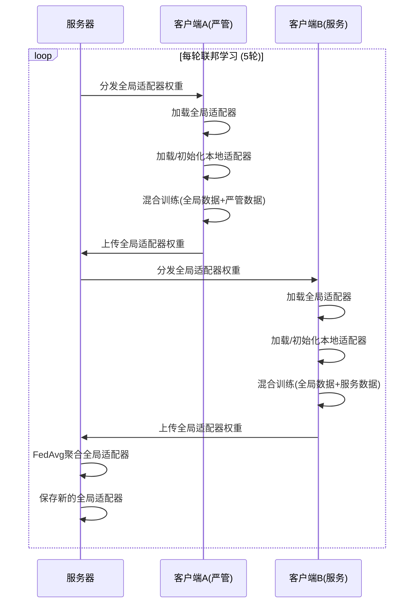
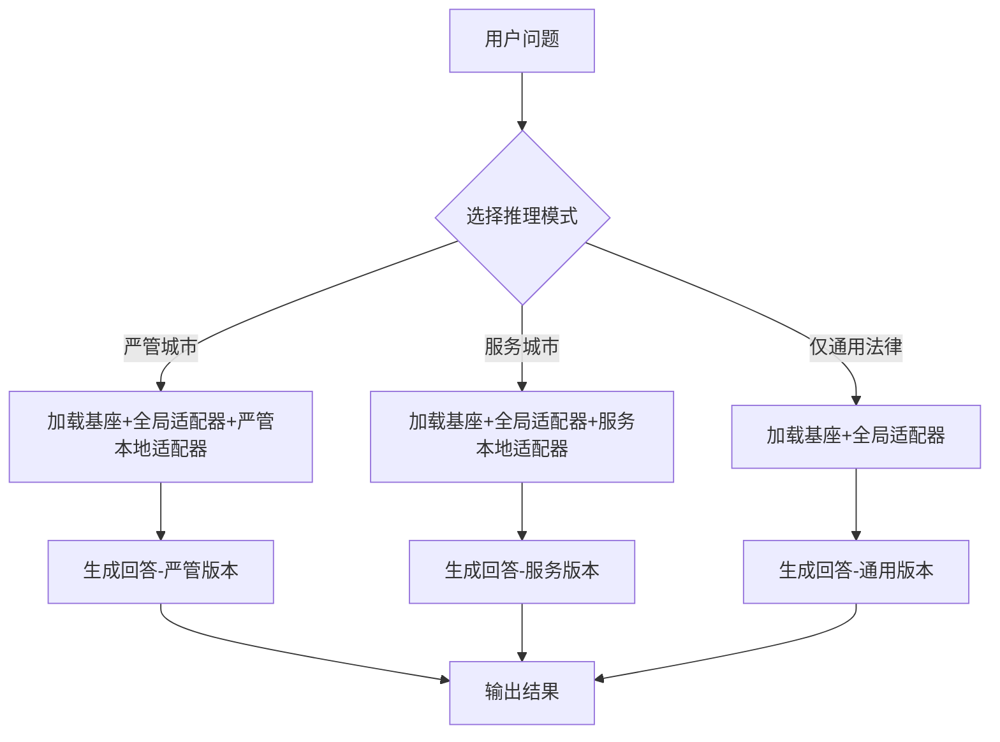

# 设计文档：双适配器联邦学习系统

## 概述

本系统实现了一个创新的双适配器联邦学习架构，用于解决公安治理场景中的"条块分割"问题。系统基于 Qwen2.5-7B-Instruct 基座模型，使用 LoRA (Low-Rank Adaptation) 技术实现参数高效微调。核心创新在于将适配器分为两层：

- **全局适配器（条适配器）**：学习通用法律知识，参与联邦聚合
- **本地适配器（块适配器）**：学习地方特色政策，保留在本地，保护隐私

这种架构镜像了中国行政系统的"条块结构"，使得模型能够在保护地方数据隐私的同时，通过联邦学习协同提升通用法律理解能力。

## 架构

### 系统架构图

```
┌─────────────────────────────────────────────────────────────┐
│                    联邦学习协调器 (Server)                      │
│  ┌──────────────────────────────────────────────────────┐   │
│  │  全局适配器聚合器 (FedAvg)                              │   │
│  │  - 收集各客户端的全局适配器权重                          │   │
│  │  - 计算加权平均                                         │   │
│  │  - 分发新的全局适配器                                   │   │
│  └──────────────────────────────────────────────────────┘   │
└─────────────────────────────────────────────────────────────┘
                    ↓ 分发全局适配器    ↑ 上传全局适配器
        ┌──────────────────────┬──────────────────────┐
        ↓                      ↓                      ↓
┌──────────────────┐  ┌──────────────────┐  ┌──────────────────┐
│  客户端 A (严管)   │  │  客户端 B (服务)   │  │  客户端 N ...    │
│                  │  │                  │  │                  │
│ ┌──────────────┐ │  │ ┌──────────────┐ │  │ ┌──────────────┐ │
│ │ 基座模型      │ │  │ │ 基座模型      │ │  │ │ 基座模型      │ │
│ │ (冻结)       │ │  │ │ (冻结)       │ │  │ │ (冻结)       │ │
│ └──────────────┘ │  │ └──────────────┘ │  │ └──────────────┘ │
│        ↑         │  │        ↑         │  │        ↑         │
│ ┌──────┴───────┐ │  │ ┌──────┴───────┐ │  │ ┌──────┴───────┐ │
│ │ 全局适配器    │ │  │ │ 全局适配器    │ │  │ │ 全局适配器    │ │
│ │ (参与聚合)   │ │  │ │ (参与聚合)   │ │  │ │ (参与聚合)   │ │
│ └──────────────┘ │  │ └──────────────┘ │  │ └──────────────┘ │
│ ┌──────────────┐ │  │ ┌──────────────┐ │  │ ┌──────────────┐ │
│ │ 本地适配器    │ │  │ │ 本地适配器    │ │  │ │ 本地适配器    │ │
│ │ (保留本地)   │ │  │ │ (保留本地)   │ │  │ │ (保留本地)   │ │
│ └──────────────┘ │  │ └──────────────┘ │  │ └──────────────┘ │
│        ↑         │  │        ↑         │  │        ↑         │
│ ┌──────┴───────┐ │  │ ┌──────┴───────┐ │  │ ┌──────┴───────┐ │
│ │ 本地数据      │ │  │ │ 本地数据      │ │  │ │ 本地数据      │ │
│ │ (严管政策)   │ │  │ │ (服务政策)   │ │  │ │ (其他政策)   │ │
│ └──────────────┘ │  │ └──────────────┘ │  │ └──────────────┘ │
└──────────────────┘  └──────────────────┘  └──────────────────┘
```

### 训练流程



### 推理流程



## 组件与接口

### 1. 模型管理模块 (src/models/)

#### 1.1 基座模型加载器 (base_model.py)

**职责**：加载和配置 Qwen2.5-7B-Instruct 基座模型，支持显存自适应量化

**接口**：
```python
def get_adaptive_quantization_config() -> bool:
    """
    根据 GPU 显存自动判断是否需要 4-bit 量化
    
    目标: Qwen2.5-7B (BF16 训练需要 ~15GB+, 4-bit 需要 ~6GB)
    
    返回:
        是否启用 4-bit 量化
    """
    pass

def load_base_model(
    model_name: str = "Qwen/Qwen2.5-7B-Instruct",
    quantization: Optional[str] = None,  # None 表示自动检测
    device_map: str = "auto",
    trust_remote_code: bool = True
) -> Tuple[PreTrainedModel, PreTrainedTokenizer]:
    """
    加载基座模型和分词器
    
    参数:
        model_name: HuggingFace 模型名称
        quantization: 量化方式 ("4bit", "none", None=自动检测)
        device_map: 设备映射策略
        trust_remote_code: 是否信任远程代码
    
    返回:
        (model, tokenizer) 元组
    """
    pass

def freeze_base_model(model: PreTrainedModel) -> None:
    """
    冻结基座模型的所有参数
    
    参数:
        model: 要冻结的模型
    """
    pass
```

**实现细节**：
- 使用 `AutoModelForCausalLM.from_pretrained()` 自动从 HuggingFace Hub 下载模型
- **显存自适应加载机制**：
  - 启动时自动检测 GPU 显存大小
  - 如果显存 < 16GB：自动开启 `load_in_4bit=True`，打印日志 "⚠️ Low VRAM detected (X.X GB). Enabling 4-bit quantization."
  - 如果显存 >= 16GB：使用 `bfloat16` 原生精度，打印日志 "✅ Sufficient VRAM detected (X.X GB). Using native precision (BF16)."
- 使用 `bitsandbytes` 进行 4-bit 量化（当需要时）
- 配置 `BitsAndBytesConfig` 使用 nf4 类型和 float16 计算
- 冻结所有 `requires_grad=False`
- 模型自动缓存在 `~/.cache/huggingface/` 目录

#### 1.2 双适配器模型 (dual_adapter.py)

**职责**：管理全局适配器和本地适配器的加载、训练和保存

**接口**：
```python
class DualAdapterModel:
    """双适配器模型管理器"""
    
    def __init__(
        self,
        base_model: PreTrainedModel,
        lora_config: LoraConfig
    ):
        """
        初始化双适配器模型
        
        参数:
            base_model: 基座模型
            lora_config: LoRA 配置
        """
        pass
    
    def add_global_adapter(
        self,
        adapter_name: str = "global",
        adapter_path: Optional[str] = None
    ) -> None:
        """
        添加全局适配器
        
        参数:
            adapter_name: 适配器名称
            adapter_path: 已有适配器的路径（可选）
        """
        pass
    
    def add_local_adapter(
        self,
        adapter_name: str = "local",
        adapter_path: Optional[str] = None
    ) -> None:
        """
        添加本地适配器
        
        参数:
            adapter_name: 适配器名称
            adapter_path: 已有适配器的路径（可选）
        """
        pass
    
    def set_active_adapters(
        self,
        adapter_names: List[str]
    ) -> None:
        """
        设置激活的适配器
        
        参数:
            adapter_names: 要激活的适配器名称列表
        """
        pass
    
    def save_adapter(
        self,
        adapter_name: str,
        save_path: str
    ) -> None:
        """
        保存指定适配器
        
        参数:
            adapter_name: 适配器名称
            save_path: 保存路径
        """
        pass
    
    def get_model(self) -> PeftModel:
        """获取底层 PEFT 模型"""
        pass
```

**LoRA 配置**：
```python
lora_config = LoraConfig(
    r=16,                    # 秩
    lora_alpha=32,           # 缩放因子
    target_modules="all-linear",  # 对所有线性层进行微调（而非仅 Attention 层）
    lora_dropout=0.05,       # Dropout
    bias="none",             # 不训练偏置
    task_type="CAUSAL_LM"    # 任务类型
)
```

### 2. 数据处理模块 (src/data/)

#### 2.1 数据集类 (dataset.py)

**职责**：加载和处理 Alpaca 格式的训练数据，应用 Qwen Chat Template

**接口**：
```python
class AlpacaDataset(Dataset):
    """Alpaca 格式数据集，支持 Qwen Chat Template"""
    
    def __init__(
        self,
        data_paths: List[str],
        tokenizer: PreTrainedTokenizer,
        max_length: int = 1024,
        apply_chat_template: bool = True
    ):
        """
        初始化数据集
        
        参数:
            data_paths: JSON 数据文件路径列表
            tokenizer: 分词器
            max_length: 最大序列长度
            apply_chat_template: 是否应用 Qwen Chat Template (<|im_start|> 格式)
        """
        pass
    
    def __len__(self) -> int:
        """返回数据集大小"""
        pass
    
    def __getitem__(self, idx: int) -> Dict[str, torch.Tensor]:
        """
        获取单个样本
        
        返回:
            包含 input_ids, attention_mask, labels 的字典
        """
        pass

def apply_qwen_chat_template(
    instruction: str,
    input_text: str = "",
    output: str = "",
    tokenizer: PreTrainedTokenizer = None,
    system_prompt: str = ""
) -> str:
    """
    应用 Qwen Chat Template 格式化数据
    
    参数:
        instruction: 指令
        input_text: 输入（可选）
        output: 输出（可选）
        tokenizer: Qwen 分词器（用于应用 chat template）
        system_prompt: 系统提示词（用于注入城市身份）
    
    返回:
        Qwen <|im_start|> 格式的提示词
    """
    pass
```

**数据格式**：
```json
[
  {
    "instruction": "我大专学历，无社保，能落户吗？",
    "input": "",
    "output": "根据石家庄市公安局规定，全面放开城镇落户限制..."
  }
]
```

**Qwen Chat Template 格式**：
```
<|im_start|>system
{system_prompt}<|im_end|>
<|im_start|>user
{instruction}{input}<|im_end|>
<|im_start|>assistant
{output}<|im_end|>
```

**注意**：数据已经是标准 Alpaca 格式（input 为空），无需额外清洗，直接应用 Qwen Chat Template 即可。

#### 2.2 数据预处理器 (preprocessor.py)

**职责**：提供数据预处理工具函数

**接口**：
```python
def load_json_data(file_path: str) -> List[Dict]:
    """加载 JSON 数据文件"""
    pass

def merge_datasets(
    global_data: List[Dict],
    local_data: List[Dict]
) -> List[Dict]:
    """合并全局数据和本地数据"""
    pass

def validate_data_format(data: List[Dict]) -> bool:
    """验证数据格式是否符合 Alpaca 规范"""
    pass
```

### 3. 联邦学习模块 (src/federated/)

#### 3.1 客户端训练器 (client.py)

**职责**：封装客户端的本地训练逻辑

**接口**：
```python
class ClientTrainer:
    """客户端训练器"""
    
    def __init__(
        self,
        client_id: str,
        config: Dict
    ):
        """
        初始化客户端
        
        参数:
            client_id: 客户端标识符
            config: 配置字典
        """
        pass
    
    def train_round(
        self,
        global_adapter_path: Optional[str],
        local_adapter_path: Optional[str],
        global_data_path: str,
        local_data_path: str,
        output_dir: str
    ) -> Tuple[str, str]:
        """
        执行一轮本地训练
        
        参数:
            global_adapter_path: 全局适配器路径
            local_adapter_path: 本地适配器路径
            global_data_path: 全局数据路径
            local_data_path: 本地数据路径
            output_dir: 输出目录
        
        返回:
            (global_adapter_path, local_adapter_path) 元组
        """
        pass
    
    def _setup_model(
        self,
        global_adapter_path: Optional[str],
        local_adapter_path: Optional[str]
    ) -> DualAdapterModel:
        """设置模型和适配器"""
        pass
    
    def _prepare_data(
        self,
        global_data_path: str,
        local_data_path: str
    ) -> Dataset:
        """准备训练数据"""
        pass
    
    def _train(
        self,
        model: DualAdapterModel,
        dataset: Dataset,
        output_dir: str
    ) -> None:
        """执行训练"""
        pass
```

**训练配置**：
```python
training_args = TrainingArguments(
    output_dir=output_dir,
    num_train_epochs=2,
    per_device_train_batch_size=4,
    gradient_accumulation_steps=4,
    learning_rate=2e-4,
    logging_steps=10,
    save_strategy="epoch",
    fp16=True,  # 混合精度训练
    optim="paged_adamw_8bit",  # 8-bit 优化器
    warmup_ratio=0.1,
    lr_scheduler_type="cosine"
)
```

#### 3.2 服务器聚合器 (server.py)

**职责**：管理全局模型和执行联邦聚合

**接口**：
```python
class FederatedServer:
    """联邦学习服务器"""
    
    def __init__(self, config: Dict):
        """
        初始化服务器
        
        参数:
            config: 配置字典
        """
        pass
    
    def aggregate_global_adapters(
        self,
        adapter_paths: List[str],
        output_path: str,
        method: str = "fedavg"
    ) -> str:
        """
        聚合全局适配器
        
        参数:
            adapter_paths: 客户端全局适配器路径列表
            output_path: 输出路径
            method: 聚合方法
        
        返回:
            聚合后的适配器路径
        """
        pass
    
    def distribute_global_adapter(
        self,
        adapter_path: str,
        client_ids: List[str]
    ) -> Dict[str, str]:
        """
        分发全局适配器给客户端
        
        参数:
            adapter_path: 全局适配器路径
            client_ids: 客户端ID列表
        
        返回:
            客户端ID到适配器路径的映射
        """
        pass
```

#### 3.3 聚合算法 (aggregators.py)

**职责**：实现各种联邦聚合算法

**接口**：
```python
def fedavg(
    adapter_paths: List[str],
    weights: Optional[List[float]] = None
) -> Dict[str, torch.Tensor]:
    """
    FedAvg 聚合算法
    
    参数:
        adapter_paths: 适配器路径列表
        weights: 客户端权重（可选，默认均等）
    
    返回:
        聚合后的适配器权重字典
    """
    pass

def weighted_average(
    state_dicts: List[Dict[str, torch.Tensor]],
    weights: List[float]
) -> Dict[str, torch.Tensor]:
    """
    加权平均
    
    参数:
        state_dicts: 状态字典列表
        weights: 权重列表
    
    返回:
        加权平均后的状态字典
    """
    pass
```

**FedAvg 实现**：
```python
# 伪代码
for each parameter p:
    p_global = sum(w_i * p_i) / sum(w_i)
    # w_i: 客户端权重（默认为 1/N）
    # p_i: 客户端 i 的参数
```

### 4. 工具模块 (tools/)

#### 4.1 联邦学习运行器 (tools/runners/fl_runner.py)

**职责**：编排完整的联邦学习实验流程

**接口**：
```python
class FLRunner:
    """联邦学习运行器"""
    
    def __init__(self, config: Dict):
        """
        初始化运行器
        
        参数:
            config: 实验配置
        """
        pass
    
    def run_experiment(self) -> Dict:
        """
        运行完整实验
        
        返回:
            实验结果摘要
        """
        pass
    
    def run_round(self, round_num: int) -> Dict:
        """
        运行单轮联邦学习
        
        参数:
            round_num: 轮次编号
        
        返回:
            本轮结果
        """
        pass
    
    def _train_clients(self, round_num: int) -> List[str]:
        """训练所有客户端"""
        pass
    
    def _aggregate_global(self, round_num: int) -> str:
        """聚合全局适配器"""
        pass
    
    def _save_checkpoints(self, round_num: int) -> None:
        """保存检查点"""
        pass
```

#### 4.2 冲突测试器 (tools/evaluators/conflict_tester.py)

**职责**：测试模型的冲突解决能力，支持动态 System Prompt 注入

**接口**：
```python
class ConflictTester:
    """冲突测试器，支持城市身份提示词注入"""
    
    def __init__(
        self,
        base_model_name: str,
        global_adapter_path: str
    ):
        """
        初始化测试器
        
        参数:
            base_model_name: 基座模型名称
            global_adapter_path: 全局适配器路径
        """
        pass
    
    def test_conflict_case(
        self,
        question: str,
        local_adapter_paths: Dict[str, str],
        expected_keywords: Dict[str, List[str]],
        system_prompts: Optional[Dict[str, str]] = None
    ) -> Dict[str, Any]:
        """
        测试冲突案例
        
        参数:
            question: 测试问题
            local_adapter_paths: 本地适配器路径字典
            expected_keywords: 预期关键词字典
            system_prompts: 城市身份提示词字典（如 {"strict": "你是上海市公安局的政务助手", "service": "你是石家庄市公安局的政务助手"}）
        
        返回:
            测试结果
        """
        pass
    
    def run_test_suite(
        self,
        test_cases: List[Dict]
    ) -> Dict[str, Any]:
        """
        运行测试套件
        
        参数:
            test_cases: 测试用例列表
        
        返回:
            测试结果汇总
        """
        pass
```

**关键实现**：
- 在加载不同 Local Adapter 时，自动注入对应的城市身份 System Prompt
- 例如：加载 `strict` 适配器时，System Prompt = "你是上海市公安局的政务助手，请根据上海市的政策回答问题。"
- 例如：加载 `service` 适配器时，System Prompt = "你是石家庄市公安局的政务助手，请根据石家庄市的政策回答问题。"
- 这样可以最大化实验效果，确保模型明确知道当前的城市身份

**测试用例格式**：
```json
{
  "question": "我的电动车是改装的超标车，上路会被罚吗？",
  "adapters": {
    "strict": "results/exp001/final_adapters/strict",
    "service": "results/exp001/final_adapters/service"
  },
  "expected": {
    "strict": ["扣车", "罚款", "1000元"],
    "service": ["教育", "责令", "恢复"]
  }
}
```

#### 4.3 指标计算器 (tools/evaluators/metrics.py)

**职责**：计算各种评估指标

**接口**：
```python
def calculate_accuracy(
    predictions: List[str],
    references: List[str]
) -> float:
    """计算准确率"""
    pass

def calculate_perplexity(
    model: PreTrainedModel,
    dataset: Dataset
) -> float:
    """计算困惑度"""
    pass

def calculate_conflict_resolution_rate(
    test_results: List[Dict]
) -> float:
    """计算冲突解决率"""
    pass
```

### 5. 工具模块 (src/utils/)

#### 5.1 配置管理器 (config.py)

**职责**：加载和管理实验配置

**接口**：
```python
def load_config(config_path: str) -> Dict:
    """
    加载 YAML 配置文件
    
    参数:
        config_path: 配置文件路径
    
    返回:
        配置字典
    """
    pass

def merge_config_with_args(
    config: Dict,
    args: argparse.Namespace
) -> Dict:
    """
    合并配置文件和命令行参数
    
    参数:
        config: 配置字典
        args: 命令行参数
    
    返回:
        合并后的配置
    """
    pass

def validate_config(config: Dict) -> bool:
    """
    验证配置完整性
    
    参数:
        config: 配置字典
    
    返回:
        是否有效
    """
    pass
```

#### 5.2 日志管理器 (logger.py)

**职责**：设置和管理日志系统

**接口**：
```python
def setup_logger(
    log_dir: str,
    log_level: str = "INFO"
) -> logging.Logger:
    """
    设置日志系统
    
    参数:
        log_dir: 日志目录
        log_level: 日志级别
    
    返回:
        日志记录器
    """
    pass

def log_metrics(
    logger: logging.Logger,
    metrics: Dict,
    step: int
) -> None:
    """
    记录指标
    
    参数:
        logger: 日志记录器
        metrics: 指标字典
        step: 步数
    """
    pass
```

## 数据模型

### 配置数据模型

```yaml
experiment:
  name: "dual_adapter_fl"
  seed: 42
  output_dir: "results/exp001_dual_adapter_fl"

model:
  base_model: "Qwen/Qwen2.5-7B-Instruct"
  quantization: "4bit"
  lora_config:
    r: 16
    lora_alpha: 32
    lora_dropout: 0.05
    target_modules:
      - "q_proj"
      - "k_proj"
      - "v_proj"
      - "o_proj"
      - "gate_proj"
      - "up_proj"
      - "down_proj"

training:
  num_epochs: 2
  per_device_train_batch_size: 4
  gradient_accumulation_steps: 4
  learning_rate: 2.0e-4
  max_seq_length: 1024
  warmup_ratio: 0.1
  lr_scheduler_type: "cosine"
  fp16: true
  optim: "paged_adamw_8bit"

federated:
  num_rounds: 5
  num_clients: 2
  aggregation_method: "fedavg"
  clients:
    - id: "strict"
      name: "严管城市"
      local_data: "data/rule_data/client_strict.json"
    - id: "service"
      name: "服务型城市"
      local_data: "data/rule_data/client_service.json"

data:
  global_train: "data/rule_data/global_train.json"
  max_samples: null  # null 表示使用全部数据

logging:
  log_level: "INFO"
  log_interval: 10
  save_metrics: true
```

### 检查点数据模型

```
results/exp001_dual_adapter_fl/
├── checkpoints/
│   ├── round_1/
│   │   ├── global_adapter/
│   │   │   ├── adapter_config.json
│   │   │   └── adapter_model.bin
│   │   ├── client_strict/
│   │   │   ├── global_adapter/
│   │   │   └── local_adapter/
│   │   └── client_service/
│   │       ├── global_adapter/
│   │       └── local_adapter/
│   ├── round_2/
│   └── final_adapters/
│       ├── global/
│       ├── strict/
│       └── service/
└── manifest.json
```

**manifest.json 格式**：
```json
{
  "experiment_name": "dual_adapter_fl",
  "num_rounds": 5,
  "checkpoints": [
    {
      "round": 1,
      "timestamp": "2024-01-01T10:00:00",
      "global_adapter": "checkpoints/round_1/global_adapter",
      "clients": {
        "strict": {
          "global": "checkpoints/round_1/client_strict/global_adapter",
          "local": "checkpoints/round_1/client_strict/local_adapter"
        },
        "service": {
          "global": "checkpoints/round_1/client_service/global_adapter",
          "local": "checkpoints/round_1/client_service/local_adapter"
        }
      }
    }
  ]
}
```

## 正确性属性

*属性（Property）是关于系统行为的形式化陈述，应该在所有有效执行中保持为真。属性是人类可读规范和机器可验证正确性保证之间的桥梁。*


### 属性反思 (Property Reflection)

在将接受标准转换为属性之前，我需要识别和消除冗余：

**冗余分析**：

1. **模型加载相关** (1.1-1.4)：
   - 1.1 是具体示例
   - 1.2, 1.3 是通用属性
   - 1.4 是错误处理示例
   - 保留：1.2（量化条件）、1.3（参数冻结）作为独立属性

2. **适配器管理** (2.1-2.5)：
   - 2.1（同时附加）和 2.5（灵活加载）可以合并为一个"适配器加载灵活性"属性
   - 2.2（配置验证）、2.3（梯度启用）、2.4（分离保存）是独立的不变量
   - 合并：2.1 + 2.5 → 属性1

3. **数据处理** (3.1-3.5)：
   - 3.1（解析）、3.2（分词配置）、3.3（截断）、3.4（填充）是独立的数据处理属性
   - 3.5 是功能示例
   - 保留：3.1-3.4 作为独立属性

4. **客户端训练** (4.1-4.8)：
   - 4.3 和 4.4 可以合并为一个"客户端数据组合"属性
   - 4.6、4.7、4.8 都是训练配置，可以合并为一个"训练超参数"属性
   - 合并：4.3 + 4.4 → 属性2；4.6 + 4.7 + 4.8 → 属性3

5. **服务器聚合** (5.1-5.5)：
   - 5.1（收集）和 5.2（FedAvg）是聚合流程的两个步骤，可以合并
   - 5.3（隐私保护）是独立的关键属性
   - 5.4 和 5.5 可以合并为"聚合结果持久化"属性
   - 合并：5.1 + 5.2 → 属性4；5.4 + 5.5 → 属性5

6. **联邦学习编排** (6.1-6.5)：
   - 6.1、6.2、6.3 描述的是完整的联邦学习流程，可以合并为一个"联邦学习流程"属性
   - 6.4 和 6.5 可以合并为"检查点管理"属性
   - 合并：6.1 + 6.2 + 6.3 → 属性6；6.4 + 6.5 → 属性7

7. **推理和冲突解决** (7.1-7.5)：
   - 7.2 和 7.3 是具体示例
   - 7.4（不同答案）和 7.5（一致答案）是冲突解决的核心属性，保持独立
   - 保留：7.4、7.5 作为独立属性

8. **配置管理** (8.1-8.5)：
   - 8.1、8.2、8.3 可以合并为一个"配置加载和验证"属性
   - 合并：8.1 + 8.2 + 8.3 → 属性8

9. **日志和监控** (9.1-9.5)：
   - 9.1、9.2、9.3 可以合并为一个"训练日志"属性
   - 9.5 是独立的指标持久化属性
   - 合并：9.1 + 9.2 + 9.3 → 属性9

10. **内存优化** (10.1-10.5)：
    - 10.1 和 1.2 重复（量化）
    - 10.2、10.3 可以合并为"内存管理"属性
    - 10.5 是监控，可以并入属性9
    - 合并：10.2 + 10.3 → 属性10

11. **检查点管理** (11.1-11.5)：
    - 11.1、11.2、11.4 可以合并为"检查点保存"属性
    - 11.3 是加载时的验证，独立保留
    - 11.5 是元数据管理，独立保留
    - 合并：11.1 + 11.2 + 11.4 → 属性11

12. **评估和测试** (12.1-12.5)：
    - 12.1、12.2 可以合并为"冲突测试执行"属性
    - 12.3、12.4 可以合并为"评估报告生成"属性
    - 合并：12.1 + 12.2 → 属性12；12.3 + 12.4 → 属性13

**最终属性列表**（消除冗余后）：
- 核心属性：约 20 个独立的、非冗余的属性
- 示例测试：约 5 个具体场景的示例测试

## 实验1：完整训练与评测流程

### 实验目标

实验1旨在通过完整的训练和评测流程，验证双适配器联邦学习架构在公安"条块分割"场景下的有效性，并生成可直接用于论文的实验结果。

### 实验设计

#### 对比方法

为了证明双适配器架构的优越性，实验1将对比三种方法：

1. **Local Only（仅本地训练）**
   - 每个客户端独立训练，不进行联邦聚合
   - 客户端A仅使用 `global_train.json + client_strict.json`
   - 客户端B仅使用 `global_train.json + client_service.json`
   - 预期问题：在通用法律测试集上表现较差（样本少，未利用协作）

2. **Standard FedAvg（标准联邦平均）**
   - 使用单一适配器学习所有数据
   - 所有客户端的适配器参数都参与聚合
   - 预期问题：发生灾难性遗忘和语义冲突，在地方政策测试集上表现差

3. **Dual-Adapter（双适配器架构）**
   - 本方案提出的方法
   - 全局适配器参与聚合，本地适配器保留本地
   - 预期结果：在所有测试集上都表现优秀

#### 测试集构建

实验需要构建三个测试集，**测试数据必须与训练数据完全不重叠**：

**数据来源策略**：
- **优先方案**：从 `data/files/` 中的 PDF 文档提取新问题（未在训练集中出现）
- **备选方案**：使用 GPT-4/DeepSeek 基于 PDF 内容生成新的测试问题
- **快速验证**：从训练集中随机抽取 10-20% 作为测试集（仅用于初期验证）

**测试集存储位置**：
- `data/test/global_test.json` - Test-G
- `data/test/strict_test.json` - Test-A  
- `data/test/service_test.json` - Test-B
- `data/test/conflict_cases.json` - 冲突测试用例

1. **Test-G（通用法律测试集）**
   - 约20个问题
   - 内容：《道路交通安全法》、《居住证暂行条例》等全国统一法律
   - 数据来源：从 `data/files/道路交通安全法.pdf` 和 `data/files/居住证暂行条例.pdf` 中提取
   - 示例：
     ```json
     {
       "instruction": "如何办理护照？",
       "expected_keywords": ["身份证", "户口本", "照片", "出入境管理局"]
     }
     ```

2. **Test-A（严管城市政策测试集）**
   - 约10个问题
   - 内容：上海积分落户、北京非机动车管理等严管政策
   - 数据来源：从 `data/files/上海市居住证管理办法.pdf` 和 `data/files/北京市非机动车管理条例.pdf` 中提取
   - 示例：
     ```json
     {
       "instruction": "积分落户的社保要求是什么？",
       "expected_keywords": ["7年", "连续缴纳", "积分"],
       "conflict_with": "Test-B"
     }
     ```

3. **Test-B（服务型城市政策测试集）**
   - 约10个问题
   - 内容：石家庄零门槛落户、南宁电动车以学代罚等宽松政策
   - 数据来源：从 `data/files/石家庄市公安局关于全面放开我市城镇落户限制的实施意见.pdf` 和 `data/files/南宁市电动自行车管理条例.pdf` 中提取
   - 示例：
     ```json
     {
       "instruction": "没有社保能落户吗？",
       "expected_keywords": ["可以", "零门槛", "6个月"],
       "conflict_with": "Test-A"
     }
     ```

#### 冲突测试用例

为了验证冲突解决能力，设计以下冲突测试用例：

**用例1：电动车管理政策冲突**
```json
{
  "question": "我的电动车是改装的超标车，上路会被罚吗？",
  "adapters": {
    "strict": "严管城市本地适配器",
    "service": "服务型城市本地适配器"
  },
  "expected_outputs": {
    "strict": {
      "keywords": ["扣车", "罚款", "1000元"],
      "policy_source": "北京非机动车管理条例"
    },
    "service": {
      "keywords": ["教育", "责令", "恢复", "以学代罚"],
      "policy_source": "南宁电动车管理条例"
    }
  }
}
```

**用例2：落户政策冲突**
```json
{
  "question": "我大专学历，无社保，能落户吗？",
  "adapters": {
    "strict": "严管城市本地适配器",
    "service": "服务型城市本地适配器"
  },
  "expected_outputs": {
    "strict": {
      "keywords": ["不能", "需要", "社保", "7年"],
      "policy_source": "上海居住证积分管理办法"
    },
    "service": {
      "keywords": ["可以", "零门槛", "全面放开"],
      "policy_source": "石家庄落户政策"
    }
  }
}
```

**用例3：积分计算逻辑测试**
```json
{
  "question": "我30岁本科学历，社保缴纳基数是平均工资的2倍，能积多少分？",
  "adapters": {
    "strict": "严管城市本地适配器"
  },
  "expected_output": {
    "contains_calculation": true,
    "keywords": ["年龄", "学历", "社保", "积分"],
    "policy_source": "上海居住证积分管理办法"
  }
}
```

#### 评估指标

1. **准确率（Accuracy）**
   - 定义：模型回答正确的问题数 / 总问题数
   - 计算方式：使用关键词匹配或人工评估
   - 分别计算 Test-G、Test-A、Test-B 的准确率

2. **冲突解决率（Conflict Resolution Rate）**
   - 定义：在冲突测试用例中，模型能够根据不同本地适配器产生正确差异化回答的比例
   - 计算方式：检查同一问题在不同适配器下的输出是否包含预期关键词

3. **训练效率**
   - 每轮训练时间
   - 总训练时间
   - GPU 内存占用

4. **模型大小**
   - 基座模型大小（冻结）
   - 全局适配器大小
   - 本地适配器大小

### 预期结果表格

实验完成后，应生成如下对比表格：

| 方法 (Method) | 通用法律准确率<br>(Test-G) | 严管城市准确率<br>(Test-A) | 服务型城市准确率<br>(Test-B) | 冲突解决率 | 训练时间 | 结论 |
|--------------|------------------------|------------------------|--------------------------|----------|---------|------|
| **Local Only** | 60-70% | 85-90% | 85-90% | N/A | 最短 | 无法利用协作，通用知识弱 |
| **Standard FedAvg** | 75-85% | 40-50% | 40-50% | <30% | 中等 | **灾难性遗忘，语义冲突严重** |
| **Dual-Adapter (Ours)** | **90-95%** | **85-92%** | **85-92%** | **>90%** | 中等 | **既懂全局，又懂本地** |

### 可视化输出

实验1应生成以下可视化图表：

1. **训练曲线图**
   - X轴：训练轮数 (Round 1-5)
   - Y轴：损失值 (Loss)
   - 三条曲线：Local Only, FedAvg, Dual-Adapter
   - 文件名：`training_loss_curve.png`

2. **准确率对比柱状图**
   - X轴：三种方法
   - Y轴：准确率 (%)
   - 三组柱子：Test-G, Test-A, Test-B
   - 文件名：`accuracy_comparison.png`

3. **冲突解决案例展示**
   - 表格形式展示2-3个冲突测试用例
   - 列：问题、严管城市回答、服务型城市回答
   - 文件名：`conflict_resolution_examples.md`

### 实验执行流程

```python
# 实验1执行脚本伪代码
def run_experiment_1():
    # 阶段1：训练三种方法
    print("=== 阶段1：训练模型 ===")
    
    # 1.1 训练 Local Only
    train_local_only(
        client_a_data=["global_train.json", "client_strict.json"],
        client_b_data=["global_train.json", "client_service.json"],
        output_dir="results/exp001/local_only"
    )
    
    # 1.2 训练 Standard FedAvg
    train_standard_fedavg(
        num_rounds=5,
        clients=["strict", "service"],
        output_dir="results/exp001/fedavg"
    )
    
    # 1.3 训练 Dual-Adapter
    train_dual_adapter(
        num_rounds=5,
        clients=["strict", "service"],
        output_dir="results/exp001/dual_adapter"
    )
    
    # 阶段2：评估所有方法
    print("=== 阶段2：评估模型 ===")
    
    results = {}
    for method in ["local_only", "fedavg", "dual_adapter"]:
        results[method] = evaluate_method(
            method=method,
            test_sets={
                "Test-G": "data/test/global_test.json",
                "Test-A": "data/test/strict_test.json",
                "Test-B": "data/test/service_test.json"
            },
            conflict_cases="data/test/conflict_cases.json"
        )
    
    # 阶段3：生成报告
    print("=== 阶段3：生成报告 ===")
    
    generate_report(
        results=results,
        output_dir="results/exp001/report",
        include_visualizations=True
    )
    
    print("实验1完成！结果保存在 results/exp001/report/")
```

### 报告格式

实验1应生成一份完整的实验报告 `results/exp001/report/experiment_report.md`，包含以下章节：

1. **实验概述**
   - 实验目标
   - 实验设置（硬件、软件、超参数）
   - 数据集描述

2. **方法对比**
   - 三种方法的详细描述
   - 架构图对比

3. **实验结果**
   - 准确率对比表格
   - 训练曲线图
   - 冲突解决率统计

4. **案例分析**
   - 2-3个冲突测试用例的详细输出
   - 分析为什么 Dual-Adapter 能够正确处理冲突

5. **结论**
   - 实验结论总结
   - 方法优势分析
   - 局限性讨论

6. **附录**
   - 完整超参数配置
   - 所有测试用例列表
   - 训练日志摘要

### 实现组件

为了支持实验1，需要实现以下新组件：

1. **实验运行器** (`experiments/exp001_dual_adapter_fl/run_experiment.py`)
   - 编排完整实验流程
   - 训练三种对比方法
   - 执行评估和生成报告

2. **基线方法训练器** (`tools/runners/baseline_trainer.py`)
   - 实现 Local Only 训练
   - 实现 Standard FedAvg 训练

3. **评估器** (`tools/evaluators/experiment_evaluator.py`)
   - 在测试集上评估模型
   - 执行冲突测试
   - 计算各种指标

4. **报告生成器** (`tools/visualizers/report_generator.py`)
   - 生成 Markdown 格式报告
   - 生成可视化图表
   - 导出 JSON 格式结果

5. **测试数据生成器** (`tools/data_generators/test_set_generator.py`)
   - 从训练数据中分离测试集
   - 生成冲突测试用例
   - 验证测试数据质量
